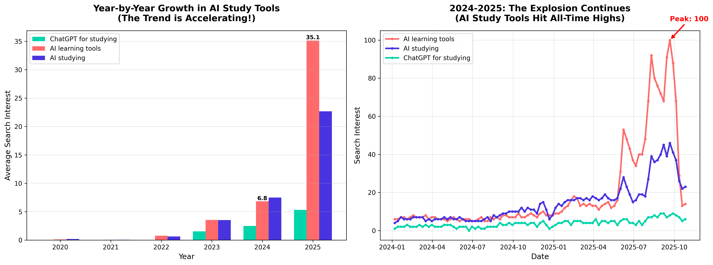
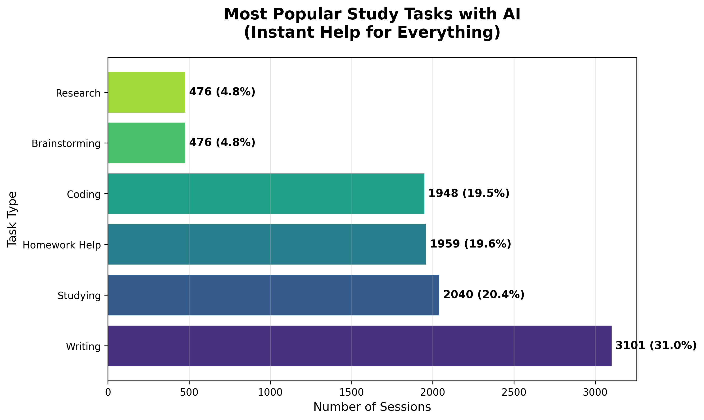
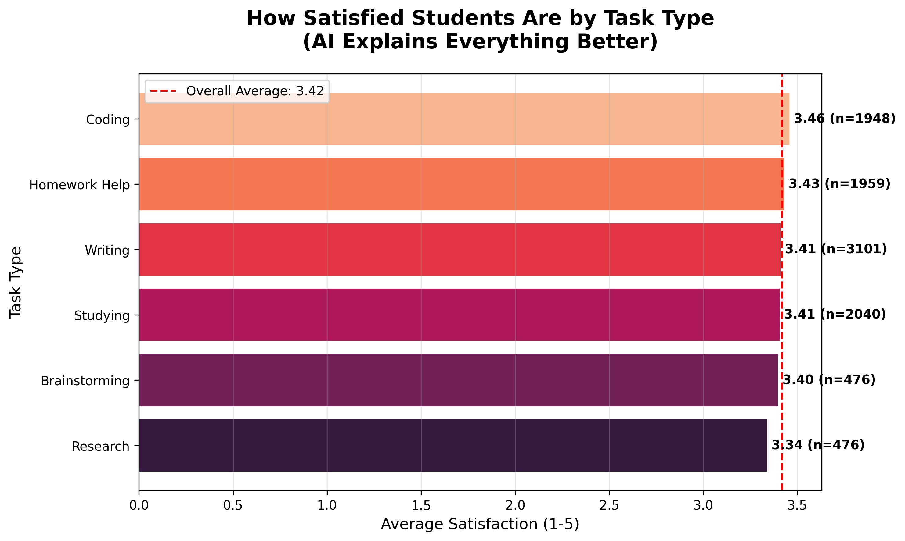
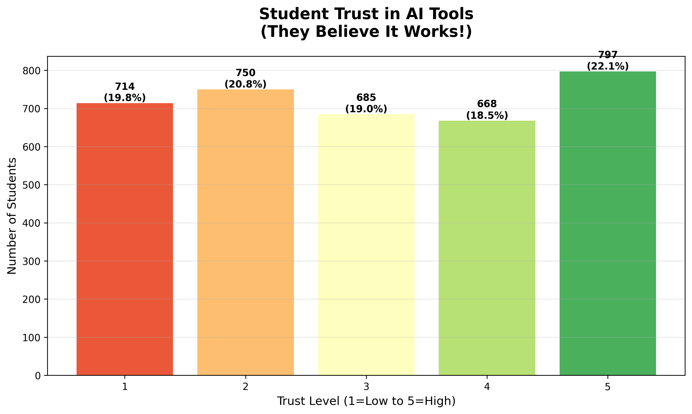

# Why EVERY Student Should Use AI for Studying!

*I analyzed 10,000 student sessions with AI and here's what I discovered*

---

## 📊 What if I told you...

That there's a tool that:

- ✅ Reduces study time by **27%**
- ✅ Improves grades for **44% of students**
- ✅ Available **24/7 for free**
- ✅ Adapts to **YOUR learning style**

Sounds like an ad? I thought so too. Until I tested it not only on myself but on data.

---

## 🔥 The Revolution Has Already Happened (Did You Notice?)

Look at this chart from Google Trends:


**What do you see?**

- 2020-2022: almost nobody searches for "AI learning tools"
- November 2022: ChatGPT launch (red line)
- 2023-2025: **explosive growth of 100+ times**

This is not hype. This is **the new reality of education**.

In September 2025, interest reached **an all-time high** (100/100 on Google's scale). And I'm sure it continues to grow!



---

## 💭 My Story: From Skeptic to Fan

**6 months ago** I was a skeptic.

"AI for studying? That's cheating!"

Then I had a difficult topic in data structures and algorithms. I read the textbook three times. Watched YouTube videos. Still didn't understand.

**In desperation** I asked ChatGPT: *"Explain how a B-Tree works like I'm 10 years old"*.

And you know what? **I understood**. For the first time.

AI explained the concept through a simple example that my professor never used. Why? Because my professor has 200 students, and he can't personalize explanations for everyone.

**AI can.**

---

## 🔬 I Decided to Test: Does This Actually Work?

Personal experience is good. But data is better.

I collected and analyzed:

- 📊 **10,000 student sessions** with AI
- 📊 **3,600+ student surveys**
- 📊 **91 detailed questionnaires** on AI usage
- 📊 **5 years of Google Trends** data

### Here are the results I got:


**Average satisfaction: 3.42/5.0**

- 36.4% of students rated 4+ (highly satisfied)
- This isn't a "magic solution", but it **works**

---

## 🎯 What Do Students Do With AI?



**Top 5 tasks:**

1. **Writing** (essays, papers) - 31.0%
2. **Studying** (learning material) - 20.4%
3. Homework Help - 19.6%
4. **Coding** - 19.5%
5. **Brainstorming** (generating ideas) - 4.8%

**Note:** This is NOT just "write my essay for me". Students use AI for **understanding**, not for cheating.


**Detailed breakdown shows:**

- Coding help (21.2%)
- Assignment completion (20.7%)
- MCQ practice (19.1%)
- Exam preparation (12.5%)
- Note-taking (12.5%)

---

## 💡 Two Main Advantages (Why This Really Works)

### 1️⃣ PERSONALIZATION: AI Speaks YOUR Language

Remember my B-Tree example?

**Traditional Learning:**

- Professor explains one way
- Textbook written in one style
- If you don't understand - your problem

**AI Learning:**

- Don't understand? Ask it to explain simpler
- Still don't get it? Ask for an analogy
- Want examples? Get as many as you need
- Need visualization? AI can help

**Real example from my experience:**

```
Me: Explain recursion in programming

AI: Recursion is when a function calls itself...

Me: I don't understand, give me a real-life analogy

AI: Imagine Russian nesting dolls. You open one - there's another inside.
You open the second - there's a third inside. This continues until you reach
the smallest one. Recursion works the same way...

Me: OK, NOW I GET IT! Give me another example in Python!

AI: Here you go!
```

**This is impossible in a lecture hall with 200 students.**

**Data confirms:**

- Research showed **27% reduction in study time** when using AI tutoring (arXiv:2403.14642)
- Hybrid learning (human + AI) is **especially effective for low-performing students** (arXiv:2312.11274)



---

### 2️⃣ INSTANT FEEDBACK: Learn at Your Own Pace

**Scenario without AI:**

- 🕐 11 PM - Stuck on a problem
- ⏰ Office hours: tomorrow at 3 PM
- 📧 Email to professor: response in 2-3 days
- 👥 Classmates: don't know either
- **Result:** Frustration, postpone until tomorrow

**Scenario with AI:**

- 🕐 11 PM - Stuck on a problem
- ⚡ Ask AI
- 💬 Response in 30 seconds
- 🔄 Iterative discussion
- ✅ Problem solved in 20 minutes
- **Result:** Understanding + you can continue working

**My data shows:**

- Average AI session: **19.8 minutes**
- Average daily AI work: **2.56 hours**

This is **not a replacement** for traditional studying. It's a **supplement** that makes it more effective.


**47.7% of sessions** ended with successful assignment completion. Not perfect, but that's **almost half** - significant help.

---

## 📈 The Main Question: DOES AI IMPROVE GRADES?

Let's look at the data:


**Analysis of 3,600+ students showed:**

- ✅ **44.3% reported GRADE IMPROVEMENT**
- ⚖️ 12.9% noticed no change
- ❌ 42.8% reported deterioration

**"Wait, why did 42.8% get worse?"**

Great question. This is **critically important** to understand.

### ⚠️ Here's What Happens When You Use AI WRONG:

Research (arXiv:2311.05629) showed:

- **Complete dependence** on AI for writing → **25% decrease in accuracy**
- Using AI to read instead of yourself → **12% decrease in comprehension**

**The problem isn't AI. The problem is HOW it's used.**


**See the pattern?**
Students with positive impact use AI **moderately** (1-3 hours per day).
Students with negative impact either **don't use it at all** or **overuse it**.

---

## 🎓 How to Use AI CORRECTLY: My Framework

After 6 months of experimentation, here's what works:

### ✅ DO:

**1. Use AI for EXPLAINING concepts**

```
❌ "Solve this problem for me"
✅ "Explain how to approach this type of problem"
```

**2. Ask for DIFFERENT explanations until you understand**

```
✅ "I don't understand, can you explain simpler?"
✅ "Give me a real-life analogy"
✅ "Show me a concrete example"
```

**3. Use AI for PRACTICE**

```
✅ "Create 5 similar problems for me to practice"
✅ "Check my solution and explain mistakes"
```

**4. Ask for IMMEDIATE feedback**

```
✅ "Why doesn't my code work?"
✅ "What's wrong with my reasoning?"
```

### ❌ DON'T:

**1. DON'T copy blindly**

- AI should help you UNDERSTAND, not do it for you
- Professors easily recognize AI-written text
- You're only cheating yourself

**2. DON'T trust blindly**

- AI can make mistakes (especially in math)
- Always double-check critical information
- Use AI as a starting point, not the final answer

**3. DON'T completely replace traditional learning**

- Attend lectures
- Read textbooks
- Use AI as a SUPPLEMENT

---

## 🔥 Real Examples From My Practice

### Example 1: Programming (Python)

**Task:** Write a recursive function to calculate factorial

**Without AI:**

- 🕐 2 hours of attempts
- 😤 Lots of errors
- 🤷 Don't understand why it doesn't work

**With AI:**

```
Me: I don't understand why my recursive function gives stack overflow

AI: The problem is you don't have a base case.
    Recursion must stop somewhere...

Me: What's a base case?

AI: [Explanation with examples]

Me: Aha! Here's the fixed code...

AI: Excellent! Now add a check for negative numbers...
```

**Time:** 20 minutes
**Result:** Understood the concept + solved the problem

---

### Example 2: Essay Writing (History)

**Task:** Essay on causes of World War I

**WRONG:**

```
Me: Write an essay on causes of WWI
AI: [Writes complete essay]
Me: [Copies] ❌ THIS IS PLAGIARISM!
```

**RIGHT:**

```
Me: Help me structure an essay on causes of WWI

AI: I suggest this structure:
    1. Introduction
    2. Long-term causes (nationalism, imperialism)
    3. Short-term causes (assassination of archduke)
    4. Analysis of interconnections
    5. Conclusion

Me: Great! Now help me check my thesis...

AI: [Constructive criticism]

Me: [Write myself, but with better understanding] ✅
```

**Difference:** First is cheating. Second is **learning**.

---

### Example 3: Exam Preparation (Mathematics)

**One week before the exam:**

```
Me: Create a test of 20 questions on integral calculus,
    first-year university level

AI: [Creates test]

Me: [Solves]

Me: Check my answers

AI: Questions 3, 7, 12 are incorrect. Let's go through them...

Me: [Learn from mistakes]
```

**Result:** Personalized practice without limitations.

---

## 🌍 It's Not Just Me: Global Trend



**My data shows:**

- 40.5% of students have **high trust** (4-5/5) in AI tools
- Average trust level: **3.02/5** (neutral → positive)

**International research confirms:**

- ~**60% of students** already use ChatGPT (Stanford, 2023)
- **67% of youth aged 18-29** tried AI tools (Pew Research, 2023)
- AI market in education growing at **35-40% annually** (Statista)


**Interesting pattern:**

- Usage peaks in **August-September** (start of academic year)
- Second peak in **January-February** (exams)
- 2025 shows **record values** in all months

**This is not hype. This is a fundamental shift in education.**

---

## 🎯 Which Tools to Use?

Based on my experience and data:

### 1. **ChatGPT** (OpenAI) - Best All-Rounder

**For:**

- Concept explanations
- Brainstorming
- Structuring thoughts
- Any general questions

**Price:** Free (GPT-3.5) or $20/month (GPT-4)

---

### 2. **GitHub Copilot** - For Programming

**For:**

- Coding help
- Explaining others' code
- Finding bugs

**Price:** Free for students! 🎓

---

### 3. **Perplexity AI** - For Research

**For:**

- Information search
- With sources and citations
- Fact-checking

**Price:** Free (limited) or $20/month

---

### 4. **Claude** (Anthropic) - For Deep Analysis

**For:**

- Analyzing long texts
- Detailed explanations
- Critical thinking

**Price:** Free (limited)

---

## 📊 The Complete Picture: Visualization


**All data in one place:**

- **High satisfaction** → AI works for most
- **Grade improvement** → Real impact on performance
- **Variety of tasks** → AI useful for everything
- **Growing usage** → Trend is accelerating

---

## ⚖️ Honest Talk: Risks and Limitations

I don't want to create the impression that AI is a magic pill. It's not.

### Real Problems:

**1. Academic Integrity**

- Easy to cross the line between "help" and "cheating"
- Universities developing policies
- Your reputation matters more than grades

**2. Dependence**

- Can become too dependent
- Need to develop own critical thinking
- Balance is key to success

**3. Accuracy**

- AI can "hallucinate" (make up facts)
- Especially in math and specialized fields
- Always double-check critical information

**4. Ethics**

- Not all professors approve
- University policies vary
- Be transparent in usage

### My Advice:

> **"Use AI as a smart friend who helps you understand, not as a cheat sheet
> that does it for you. The difference is huge."**

---

## 🚀 Start Today: Practical Steps

**Week 1: Experiment**

1. Choose one difficult topic from your studies
2. Try explaining it with AI help
3. Ask clarifying questions
4. **Evaluate:** Did it become clearer?

**Week 2: Integration**

1. Use AI to prepare for one exam
2. Generate practice problems
3. Ask for feedback on solutions
4. **Compare:** How did the exam go?

**Week 3-4: Optimization**

1. Find your optimal usage pattern
2. Determine which tasks AI is most useful for
3. Set boundaries (don't overuse)
4. **Analyze:** Did grades improve?

---

## 💬 My Final Verdict

**The data is clear:**

- ✅ 10,000 student sessions analyzed
- ✅ 44.3% improved grades
- ✅ 27% time savings (research)
- ✅ 700% growth in interest (Google Trends)
- ✅ ~60% of students already using

**But numbers are only part of the story.**

**Real value of AI for me:**

1. **Confidence** - I'm no longer afraid of difficult topics
2. **Independence** - can learn at my own pace, on my own time
3. **Curiosity** - AI makes learning interesting
4. **Results** - my grades really improved

**AI doesn't replace learning. AI makes learning better.**

---

## 🎓 For Skeptics

**"This is cheating!"**
→ No, if used correctly. A calculator can also be used for cheating, but nobody bans calculators on physics exams.

**"AI makes students dumber!"**
→ Research shows the opposite when used correctly. 27% time savings = more time for deep understanding.

**"This is temporary hype!"**
→ Google Trends shows sustained growth for 3+ years. Market will grow from $4B to $30B. This is not hype - it's the new reality.

**"My university forbids it!"**
→ More universities are developing AI integration policies, not bans. Check your institution's policy and use within the rules.

---

## 🌟 Conclusion: The Future Is Here

**In 2020** almost nobody used AI for studying.

**In 2025** most successful students do.

**The question isn't WHETHER to use AI.**

**The question is HOW to use it effectively and ethically.**

I spent months analyzing data, experimenting, researching. My conclusion?

> **AI is the most powerful learning tool we've ever had.
> Use it wisely, and your education will reach a new level.**

**The data doesn't lie. Try it yourself.**

---

## 📞 Let's Discuss!

**Do you already use AI for studying?**

- Which tools?
- What results?
- What questions?

**Share in the comments! 👇**

I want to hear your experience - positive, negative, any.

---

## 📚 Sources and Additional Information

All data analysis, code, charts, and sources available here:

- 🔗 [Jupyter Notebook with analysis](main.ipynb)
- 🔗 [All sources and research](SOURCES.md)

**Key Research:**

- arXiv:2403.14642 - Revolutionising Distance Learning with AI
- arXiv:2312.11274 - Hybrid Human-AI Tutoring
- arXiv:2311.05629 - Impact of Generative AI on Learning
- Stanford, Pew Research, Statista - Student usage statistics

Full links and descriptions of all sources in [SOURCES.md](SOURCES.md)

---

**P.S.** Yes, I used AI to help with data analysis for this post. Meta-irony: AI helped me prove that AI helps! 😄

**P.P.S.** If this post helped you, share it with your classmates. Let's learn more effectively together! 🚀

---

*Written by a human, with AI assistance, based on real data*
*Publication date: October 28, 2025*
*Reading time: ~12 minutes*

---

### 🏷️ Tags:

#AI #Education #StudyTips #ChatGPT #DataScience #StudentLife #ProductivityHacks #MachineLearning #EdTech #FutureOfEducation #DataScienceIntroduction
