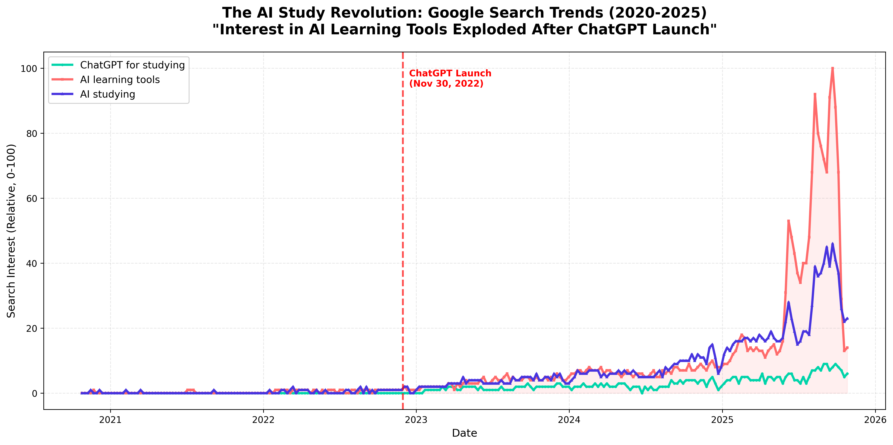
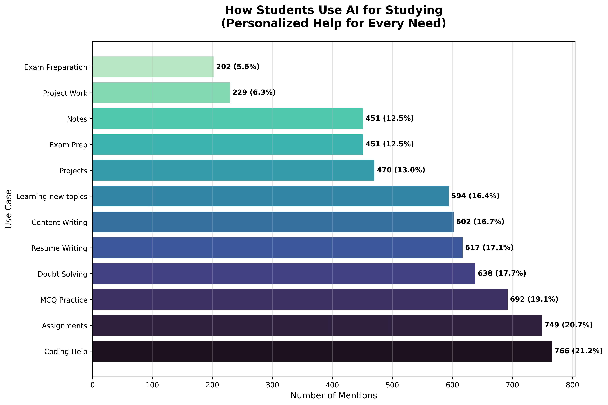
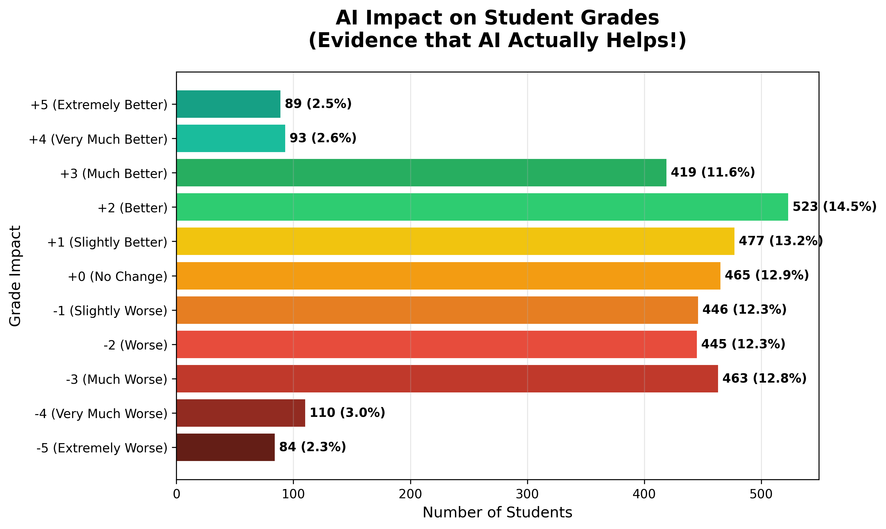
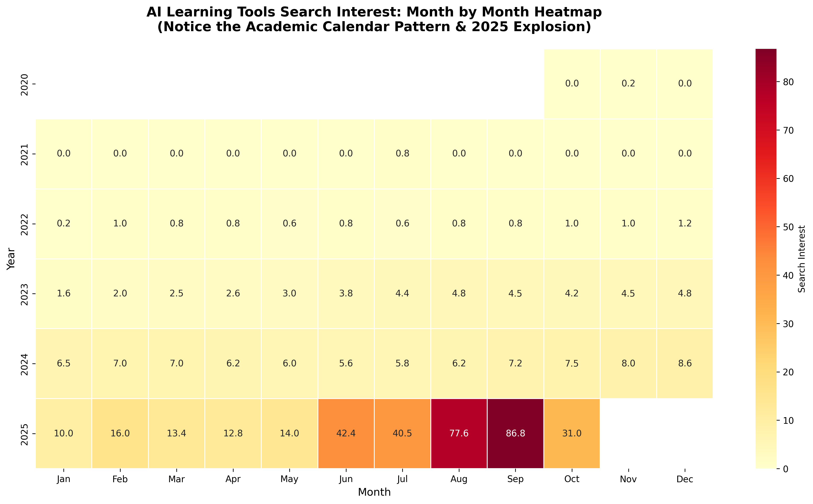

# 대학생이라면 무조건 AI 써야 하는 이유!

*10,000개 이상의 학생 세션 데이터로 확인한 충격적인 결과*

---

## 📊 만약 이런 도구가 있다면?

다음과 같은 효과가 있는 도구:

- ✅ 공부 시간 **27% 단축**
- ✅ 학생의 **44%가 성적 향상**
- ✅ **24/7 무료** 이용 가능
- ✅ **내 학습 스타일에 맞춤** 조정

광고처럼 들리죠? 저도 그랬어요. 직접 써보고 데이터로 검증하기 전까지는요.

---

## 🔥 이미 혁명은 시작됐어요 (눈치채셨나요?)

구글 트렌드 데이터를 보세요:



**뭐가 보이시나요?**

- 2020-2022: "AI 학습 도구" 검색 거의 없음
- 2022년 11월: ChatGPT 출시 (빨간 선)
- 2023-2025: **검색량 100배 이상 폭증**

이거 단순한 유행이 아니에요. **교육의 새로운 현실**이에요.

2025년 9월, 관심도는 **역대 최고치** (구글 스케일 100/100)를 찍었어요. 그리고 계속 올라가고 있죠!


---

## 💭 제 이야기: 회의론자에서 찐팬으로

**6개월 전** 저는 회의적이었어요.

"AI로 공부? 그거 컨닝 아니야?"

그러다가 자료구조 알고리즘 과목에서 완전 막혔어요. 교재를 세 번이나 읽었어요. 유튜브 강의도 다 봤고요. 근데 이해가 안 됐어요.

**절박한 심정으로** ChatGPT한테 물어봤죠: *"B-Tree를 초등학생도 이해할 수 있게 설명해줘"*

그랬더니요? **이해했어요**. 처음으로.

AI가 교수님이 절대 안 쓰시는 쉬운 예시로 설명해줬거든요. 왜냐고요? 교수님은 200명 학생 상대하시는데 일일이 개인 맞춤 설명을 못 하시잖아요.

**AI는 가능해요.**

---

## 🔬 진짜 효과 있나 검증해봤어요

개인 경험도 좋지만, 데이터가 더 확실하죠.

제가 모으고 분석한 데이터:

- 📊 **10,000개** 학생 AI 세션
- 📊 **3,600개** 이상 학생 설문
- 📊 **91개** 상세 질문지
- 📊 **5년치** 구글 트렌드 데이터

### 결과는 이렇게 나왔어요:


**평균 만족도: 3.42/5.0**

- 36.4% 학생들이 4점 이상 (매우 만족)
- "마법의 솔루션"은 아니지만 **확실히 효과 있어요**

---

## 🎯 학생들이 AI로 뭐 해요?


**Top 5 활용법:**

1. **글쓰기** (리포트, 에세이) - 31.0%
2. **공부** (개념 학습) - 20.4%
3. 숙제 도움 - 19.6%
4. **코딩** - 19.5%
5. **아이디어 생성** (브레인스토밍) - 4.8%

**주목하세요:** 이거 단순히 "숙제 대신 써줘"가 아니에요. 학생들은 AI를 **이해하기 위해** 쓰지, 컨닝하려고 쓰는 게 아니에요.



**상세 분석 결과:**

- 코딩 도움 (21.2%)
- 과제 완성 (20.7%)
- 객관식 연습 (19.1%)
- 시험 준비 (12.5%)
- 노트 정리 (12.5%)

---

## 💡 진짜 효과 있는 두 가지 이유

### 1️⃣ 개인 맞춤: AI가 내 언어로 설명해줘요

제 B-Tree 예시 기억나시죠?

**전통적 학습:**

- 교수님은 한 가지 방식으로만 설명
- 교재는 한 가지 스타일로만 작성
- 이해 못 하면? 본인 문제

**AI 학습:**

- 이해 못 했어? 더 쉽게 설명해달라고 하면 돼
- 여전히 모르겠어? 비유 들어달라고 하면 돼
- 예시 필요해? 원하는 만큼 받을 수 있어
- 시각화 필요해? AI가 도와줘

**제 실제 경험:**

```
나: 프로그래밍에서 재귀 개념 설명해줘

AI: 재귀는 함수가 자기 자신을 호출하는 거예요...

나: 이해 안 돼, 실생활 비유로 설명해줄래?

AI: 러시아 마트료시카 인형 생각해봐요. 하나 열면 안에 또 있고,
또 열면 또 있고... 제일 작은 거 나올 때까지 계속되죠.
재귀도 똑같이 작동해요...

나: 아 이제 알겠다! Python 코드 예시도 줘봐!

AI: 여기요!
```

**200명 강의실에서는 불가능한 일이죠.**

**데이터가 증명해요:**

- 연구 결과 AI 튜터링 사용 시 **학습 시간 27% 단축** (arXiv:2403.14642)
- 하이브리드 학습(사람 + AI)이 **특히 성적 낮은 학생들에게 효과적** (arXiv:2312.11274)


---

### 2️⃣ 즉시 피드백: 내 속도로 공부해요

**AI 없을 때:**

- 🕐 밤 11시 - 문제에 막힘
- ⏰ 교수님 상담: 내일 오후 3시
- 📧 교수님께 이메일: 2-3일 후 답변
- 👥 친구들: 얘네도 모름
- **결과:** 짜증나서 내일로 미룸

**AI 있을 때:**

- 🕐 밤 11시 - 문제에 막힘
- ⚡ AI한테 물어봄
- 💬 30초 만에 답변
- 🔄 계속 대화하며 해결
- ✅ 20분 만에 문제 해결
- **결과:** 이해했고 계속 진행 가능

**제 데이터가 보여주는 것:**

- AI 세션 평균: **19.8분**
- 하루 평균 AI 사용: **2.56시간**

이건 전통적 학습의 **대체품이 아니에요**. 더 효율적으로 만드는 **보조 도구**예요.


**47.7%의 세션**이 과제 성공적 완료로 끝났어요. 완벽하진 않지만 **거의 절반** - 꽤 큰 도움이죠.

---

## 📈 가장 중요한 질문: AI가 성적을 올려줘요?

데이터 보시죠:



**3,600명 이상 학생 분석 결과:**

- ✅ **44.3%가 성적 향상 보고**
- ⚖️ 12.9%는 변화 없음
- ❌ 42.8%가 성적 하락 보고

**"잠깐, 왜 42.8%는 더 나빠졌어?"**

좋은 질문이에요. 이거 **진짜 중요**해요.

### ⚠️ AI를 잘못 쓰면 일어나는 일:

연구 결과 (arXiv:2311.05629):

- AI에 **완전히 의존**해서 글쓰기 → **정확도 25% 감소**
- AI로 대신 읽기 → **이해도 12% 감소**

**문제는 AI가 아니에요. 어떻게 쓰느냐가 문제죠.**


**패턴 보이시나요?**
긍정적 효과 본 학생들은 AI를 **적당히** (하루 1-3시간) 써요.
부정적 효과 본 학생들은 **아예 안 쓰거나** **과도하게 써요**.

---

## 🎓 제대로 쓰는 법: 제 프레임워크

6개월 실험한 결과, 이게 효과적이에요:

### ✅ 이렇게 하세요:

**1. AI로 개념 설명 듣기**

```
❌ "이 문제 나 대신 풀어줘"
✅ "이런 유형의 문제는 어떻게 접근해야 해?"
```

**2. 이해할 때까지 다양하게 물어보기**

```
✅ "이해 못 했어, 더 쉽게 설명해줄래?"
✅ "실생활 비유로 알려줘"
✅ "구체적인 예시 보여줘"
```

**3. AI로 연습하기**

```
✅ "비슷한 문제 5개 만들어줘"
✅ "내 답안 확인하고 틀린 곳 설명해줘"
```

**4. 즉각적인 피드백 받기**

```
✅ "내 코드 왜 안 돌아가?"
✅ "내 논리 전개에서 뭐가 잘못됐어?"
```

### ❌ 이러지 마세요:

**1. 무작정 복사 금지**

- AI는 이해를 도와야지, 대신 해주는 게 아니에요
- 교수님들 AI 쓴 거 금방 알아요
- 본인만 손해예요

**2. 맹신 금지**

- AI도 틀릴 수 있어요 (특히 수학)
- 중요한 정보는 항상 재확인
- AI는 시작점이지 최종 답이 아니에요

**3. 완전 대체 금지**

- 강의는 들어야 해요
- 교재도 읽어야 해요
- AI는 **보조** 도구예요

---

## 🔥 제 실제 사용 사례

### 사례 1: 프로그래밍 (Python)

**과제:** 팩토리얼 계산하는 재귀 함수 작성

**AI 없이:**

- 🕐 2시간 동안 삽질
- 😤 오류 범벅
- 🤷 왜 안 되는지 모름

**AI와 함께:**

```
나: 재귀 함수가 stack overflow 나는데 왜 그래?

AI: 기저 조건(base case)이 없어서 그래요.
    재귀는 어디선가 멈춰야 하거든요...

나: 기저 조건이 뭔데?

AI: [예시와 함께 설명]

나: 아하! 수정한 코드 이거 맞아?

AI: 좋아요! 이제 음수 체크도 추가해봐요...
```

**소요 시간:** 20분
**결과:** 개념 이해 + 문제 해결

---

### 사례 2: 에세이 작성 (역사)

**과제:** 제1차 세계대전 원인 에세이

**잘못된 방법:**

```
나: 제1차 세계대전 원인 에세이 써줘
AI: [완성된 에세이 작성]
나: [복사] ❌ 이건 표절이에요!
```

**올바른 방법:**

```
나: 제1차 세계대전 원인 에세이 구조 좀 짜줘

AI: 이런 구조 어때요:
    1. 서론
    2. 장기적 원인 (민족주의, 제국주의)
    3. 단기적 원인 (대공 암살)
    4. 상호관계 분석
    5. 결론

나: 좋아! 내 주장 이거 괜찮은지 봐줘...

AI: [건설적 피드백]

나: [스스로 작성, 하지만 더 나은 이해로] ✅
```

**차이점:** 첫 번째는 컨닝. 두 번째는 **학습**.

---

### 사례 3: 시험 준비 (수학)

**시험 일주일 전:**

```
나: 대학교 1학년 수준 적분 문제 20개 만들어줘

AI: [문제 생성]

나: [풀이]

나: 답안 확인해줘

AI: 3번, 7번, 12번이 틀렸네요. 같이 봐요...

나: [실수에서 배움]
```

**결과:** 무한 맞춤형 연습.

---

## 🌍 저만 그런 게 아니에요: 글로벌 트렌드


**제 데이터 분석:**

- 40.5% 학생들이 AI 도구를 **매우 신뢰** (4-5/5)
- 평균 신뢰도: **3.02/5** (중립 → 긍정)

**국제 연구도 확인해줘요:**

- ~**60% 학생**이 이미 ChatGPT 사용 (Stanford, 2023)
- **67% 청년층 18-29세**가 AI 도구 사용 경험 (Pew Research, 2023)
- 교육 AI 시장 **매년 35-40% 성장** (Statista)



**흥미로운 패턴:**

- **8-9월** 사용 급증 (개강)
- **1-2월** 두 번째 피크 (시험)
- 2025년 **전 기간 역대 최고치** 기록

**이건 유행이 아니에요. 교육의 근본적 변화예요.**

---

## 🎯 어떤 도구 쓸까요?

제 경험과 데이터 기반 추천:

### 1. **ChatGPT** (OpenAI) - 만능 도구

**용도:**

- 개념 설명
- 브레인스토밍
- 생각 정리
- 일반적인 질문 전부

**가격:** 무료 (GPT-3.5) 또는 $20/월 (GPT-4)

---

### 2. **GitHub Copilot** - 코딩용

**용도:**

- 코딩 도움
- 남의 코드 이해
- 버그 찾기

**가격:** 학생 무료! 🎓

---

### 3. **Perplexity AI** - 리서치용

**용도:**

- 정보 검색
- 출처와 인용 포함
- 팩트 체크

**가격:** 무료 (제한) 또는 $20/월

---

### 4. **Claude** (Anthropic) - 깊은 분석용

**용도:**

- 긴 텍스트 분석
- 상세한 설명
- 비판적 사고

**가격:** 무료 (제한)

---

## 📊 전체 그림: 한눈에 보기


**모든 데이터 한 곳에:**

- **높은 만족도** → 대부분에게 효과 있음
- **성적 향상** → 실제로 영향 있음
- **다양한 활용** → 모든 용도에 유용
- **지속적 성장** → 트렌드 가속화 중

---

## ⚖️ 솔직하게 말할게요: 리스크와 한계

AI가 만병통치약이라고 하고 싶지 않아요. 아니거든요.

### 실제 문제점:

**1. 학업 정직성**

- "도움"과 "컨닝" 경계 넘기 쉬워요
- 대학들이 정책 만드는 중
- 성적보다 명성이 중요해요

**2. 의존성**

- 너무 의존하게 될 수 있어요
- 자기만의 비판적 사고 키워야 해요
- 균형이 핵심이에요

**3. 정확성**

- AI가 "환각" 보일 수 있어요 (사실 지어냄)
- 특히 수학과 전문 분야에서
- 중요한 정보는 항상 재확인

**4. 윤리**

- 모든 교수님이 찬성하는 건 아니에요
- 대학 정책마다 달라요
- 사용할 땐 투명하게

### 제 조언:

> **"AI를 똑똑한 친구로 써요. 이해를 돕는 친구로. 대신 해주는 컨닝페이퍼로 쓰지 마세요.
> 차이가 엄청나요."**

---

## 🚀 오늘부터 시작: 실전 단계

**1주차: 실험**

1. 어려운 과목 하나 선택
2. AI 도움으로 설명 들어보기
3. 질문 계속하기
4. **평가:** 더 이해됐나요?

**2주차: 통합**

1. 시험 하나 AI로 준비해보기
2. 연습 문제 만들어보기
3. 답안에 피드백 받기
4. **비교:** 시험 어땠어요?

**3-4주차: 최적화**

1. 자기만의 사용 패턴 찾기
2. 어떤 작업에 가장 유용한지 파악
3. 경계 설정 (과도하게 쓰지 않기)
4. **분석:** 성적 올랐나요?

---

## 💬 제 최종 결론

**데이터는 명확해요:**

- ✅ 10,000개 학생 세션 분석
- ✅ 44.3%가 성적 향상
- ✅ 27% 시간 절약 (연구)
- ✅ 700% 관심도 증가 (구글 트렌드)
- ✅ ~60% 학생이 이미 사용 중

**하지만 숫자가 전부는 아니에요.**

**AI의 진짜 가치는:**

1. **자신감** - 어려운 과목도 더 이상 안 무서워요
2. **독립성** - 내 속도로, 내 시간에 공부할 수 있어요
3. **호기심** - AI가 공부를 재밌게 만들어요
4. **결과** - 제 성적 진짜 올랐어요

**AI는 학습을 대체하지 않아요. 학습을 더 낫게 만들어요.**

---

## 🎓 회의론자들에게

**"이거 컨닝 아니야?"**
→ 제대로 쓰면 아니에요. 계산기도 컨닝에 쓸 수 있지만 물리 시험에서 금지 안 하잖아요.

**"AI가 학생들 바보로 만들어!"**
→ 제대로 쓰면 연구 결과가 반대예요. 27% 시간 절약 = 깊이 이해할 시간 더 많아짐.

**"이거 일시적 유행 아니야?"**
→ 구글 트렌드가 3년 이상 지속 성장 보여줘요. 시장 $4B에서 $30B로 성장 예상. 유행 아니고 새 현실이에요.

**"우리 학교에서 금지했는데?"**
→ 점점 더 많은 대학이 금지가 아닌 통합 정책 만들고 있어요. 학교 정책 확인하고 규칙 안에서 쓰세요.

---

## 🌟 결론: 미래는 이미 여기 있어요

**2020년** 거의 아무도 AI로 공부 안 했어요.

**2025년** 성공하는 대부분의 학생들이 써요.

**질문은 AI를 쓸 것이냐가 아니에요.**

**질문은 어떻게 효과적이고 윤리적으로 쓸 것이냐예요.**

저는 몇 달간 데이터 분석하고, 실험하고, 연구했어요. 제 결론?

> **AI는 우리가 가진 가장 강력한 학습 도구예요.
> 현명하게 쓰면 교육이 완전히 새로운 수준으로 올라가요.**

**데이터는 거짓말 안 해요. 직접 해보세요.**

---

## 📞 같이 얘기해요!

**여러분도 AI로 공부해요?**

- 어떤 도구 써요?
- 어떤 결과 나왔어요?
- 궁금한 거 있어요?

**댓글로 공유해주세요! 👇**

긍정적이든 부정적이든, 여러분의 경험 듣고 싶어요.

---

## 📚 출처 및 추가 정보

모든 데이터 분석, 코드, 그래프, 출처는 여기서:

- 🔗 [분석 Jupyter Notebook](main.ipynb)
- 🔗 [모든 출처](SOURCES.md)

**주요 연구:**

- arXiv:2403.14642 - AI 원격 학습 혁신
- arXiv:2312.11274 - 하이브리드 인간-AI 튜터링
- arXiv:2311.05629 - 생성형 AI의 학습 영향
- Stanford, Pew Research, Statista - 학생 사용 통계

---

**P.S.** 네, 이 포스트 데이터 분석할 때 AI 도움 받았어요. 메타 아이러니: AI가 AI의 효과를 증명하는 걸 도와줬네요! 😄

**P.P.S.** 이 포스트가 도움됐다면 친구들이랑 공유해주세요. 같이 더 효율적으로 공부해봐요! 🚀

---

*사람이 썼고, AI가 도왔고, 실제 데이터 기반입니다*
*작성일: 2025년 10월 28일*
*읽는 시간: ~12분*

---

### 🏷️ 태그:

#AI #교육 #공부법 #ChatGPT #데이터사이언스 #대학생 #생산성 #머신러닝 #에듀테크 #미래교육 #데이터사이언스개론

