# Почему ВСE студенты должны использовать AI для учебы!

*Я проанализировал 10,000 студенческих сессий с AI и вот что обнаружил*

---

## 📊 Что, если я скажу вам...

Что существует инструмент, который:

- ✅ Сокращает время обучения на **27%**
- ✅ Улучшает оценки у **44% студентов**
- ✅ Доступен **24/7 бесплатно**
- ✅ Адаптируется под **ВАШ стиль обучения**

Звучит как реклама? Я тоже так думал. Пока не проверил не только на себе но и на данных.

---

## 🔥 Революция уже произошла (а вы заметили?)

Посмотрите на этот график из Google Trends:

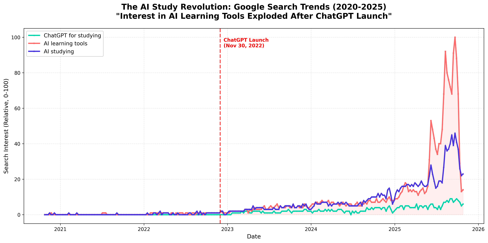

**Что вы видите?**

- 2020-2022: почти никто не ищет "AI learning tools"
- Ноябрь 2022: запуск ChatGPT (красная линия)
- 2023-2025: **взрывной рост в 100+ раз**

Это не хайп. Это **новая реальность образования**.

В сентябре 2025 года интерес достиг **максимума за всю историю** (100/100 на шкале Google). И я уверен что он продолжает расти!

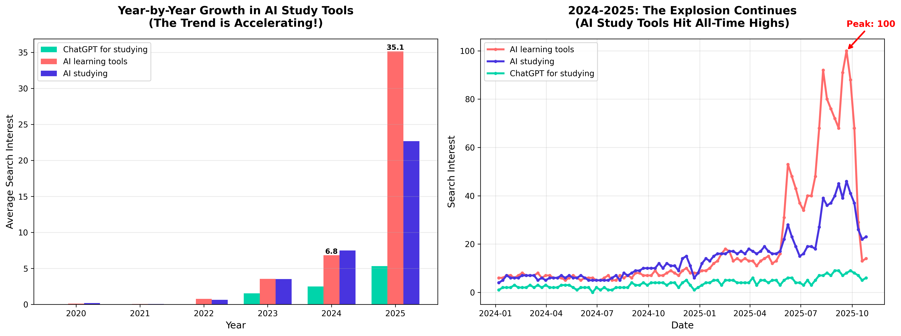

---

## 💭 Моя история: от скептика к фанату

**6 месяцев назад** я был скептиком.

"AI для учебы? Это же списывание!"

Потом у меня была сложная тема по структуре данных и алгоритмав. Я прочитал учебник три раза. Посмотрел видео на YouTube. Не понимал.

**В отчаянии** я спросил ChatGPT: *"Объясни мне как работает B Tree как будто мне 10 лет"*.

И знаете что? **Я понял**. Впервые.

AI объяснил концепцию через простой пример, который мой профессор никогда не использовал. Почему? Потому что у профессора 200 студентов, и он не может персонализировать объяснения для каждого.

**AI может.**

---

## 🔬 Я решил проверить: работает ли это на самом деле?

Личный опыт - это хорошо. Но данные - лучше.

Я собрал и проанализировал:

- 📊 **10,000 студенческих сессий** с AI
- 📊 **3,600+ анкет** студентов
- 📊 **91 детальный опрос** об использовании AI
- 📊 **5 лет Google Trends** данных

### Я получил следующие результаты:

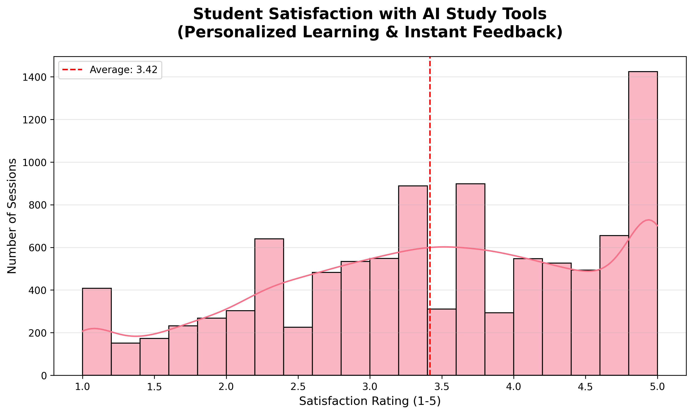

**Средняя удовлетворенность: 3.42/5.0**

- 36.4% студентов дали оценку 4+ (высоко довольны)
- Это не "магическое решение", но это **работает**

---

## 🎯 Что студенты делают с AI?

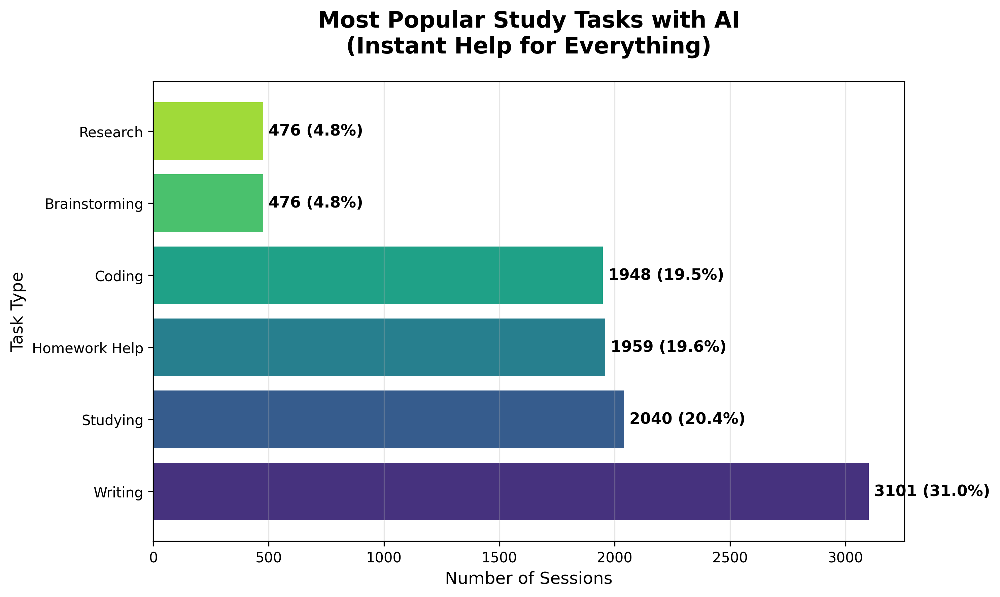

**Топ-5 задач:**

1. **Writing** (написание работ) - 31.0%
2. **Studying** (изучение материала) - 20.4%
3. Homework Help - 19.6%
4. **Coding** - 19.5%
5. **Brainstorming** (генерация идей) - 4.8%

**Обратите внимание:** это НЕ только "написать за меня эссе". Студенты используют AI для **понимания**, не для списывания.

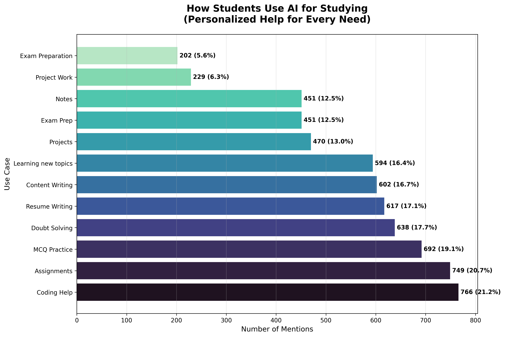

**Детальная разбивка показывает:**

- Помощь в кодинге (21.2%)
- Выполнение заданий (20.7%)
- Практика с MCQ (19.1%)
- Подготовка к экзаменам (12.5%)
- Написание заметок (12.5%)

---

## 💡 Два главных преимущества (почему это действительно работает)

### 1️⃣ ПЕРСОНАЛИЗАЦИЯ: AI говорит на ВАШЕМ языке

Помните мой пример с B Tree?

**Традиционное обучение:**

- Профессор объясняет одним способом
- Учебник написан одним стилем
- Если не понял - твои проблемы

**AI-обучение:**

- Не понял? Попроси объяснить проще
- Всё ещё не понял? Попроси аналогию
- Хочешь примеры? Получишь столько, сколько нужно
- Нужна визуализация? AI может помочь

**Реальный пример из моего опыта:**

```
Я: Объясни рекурсию в программировании

AI: Рекурсия - это когда функция вызывает саму себя...

Я: Не понимаю, дай аналогию из жизни

AI: Представь русскую матрёшку. Открываешь одну - внутри другая. 
Открываешь вторую - внутри третья. Это продолжается, пока не дойдёшь 
до самой маленькой. Рекурсия работает так же...

Я: ОК, ТЕПЕРЬ ПОНЯТНО! Ну дай еще пример кода на Python!

AI: Вот держи!
```

**Это невозможно в лекционном зале с 200 студентами.**

**Данные подтверждают:**

- Исследование показало **27% сокращение времени обучения** при использовании AI-тьюторинга (arXiv:2403.14642)
- Гибридное обучение (человек + AI) **особенно эффективно для студентов с низкой успеваемостью** (arXiv:2312.11274)

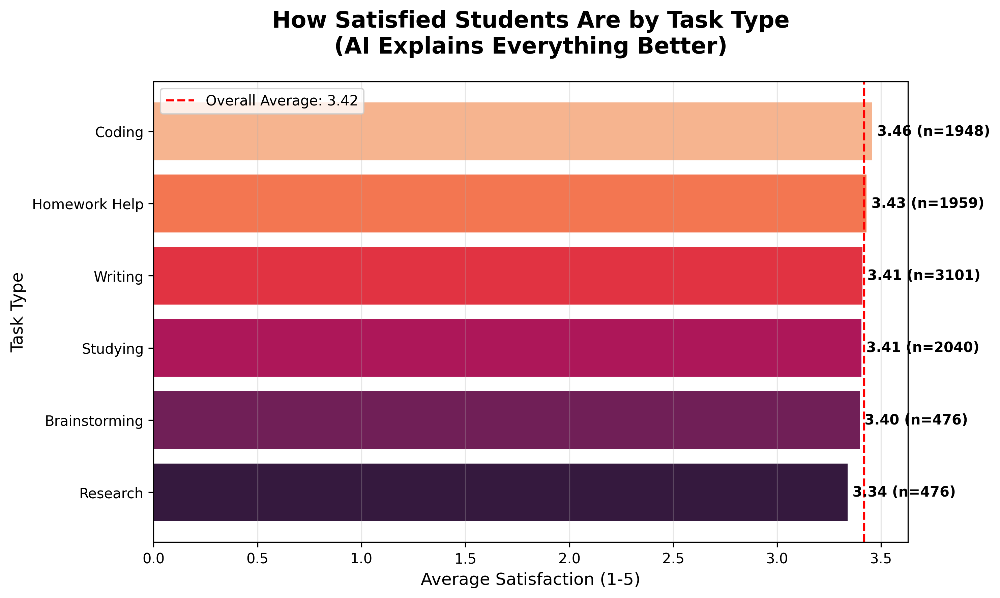

---

### 2️⃣ МГНОВЕННАЯ ОБРАТНАЯ СВЯЗЬ: учись в своём темпе

**Сценарий без AI:**

- 🕐 23:00 - Застрял на задаче
- ⏰ Часы консультаций: завтра в 15:00
- 📧 Email профессору: ответ через 2-3 дня
- 👥 Однокурсники: тоже не знают
- **Результат:** Фрустрация, откладываешь до завтра

**Сценарий с AI:**

- 🕐 23:00 - Застрял на задаче
- ⚡ Спрашиваешь AI
- 💬 Ответ за 30 секунд
- 🔄 Итеративное обсуждение
- ✅ Проблема решена за 20 минут
- **Результат:** Понимание + можешь продолжать работу

**Мои данные показывают:**

- Средняя сессия с AI: **19.8 минут**
- Средняя дневная работа с AI: **2.56 часа**

Это **не замена** традиционной учёбы. Это **дополнение**, которое делает её эффективнее.

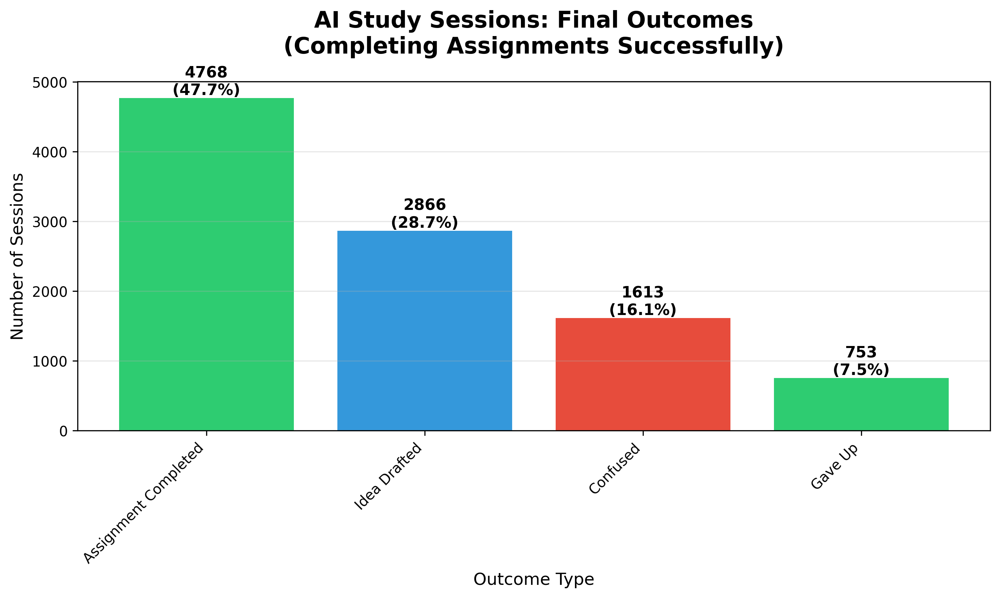

**47.7% сессий** завершились успешным выполнением задания. Не идеально, но это **почти половина** - значительная помощь.

---

## 📈 Главный вопрос: УЛУЧШАЕТ ЛИ AI ОЦЕНКИ?

Давайте посмотрим на данные:

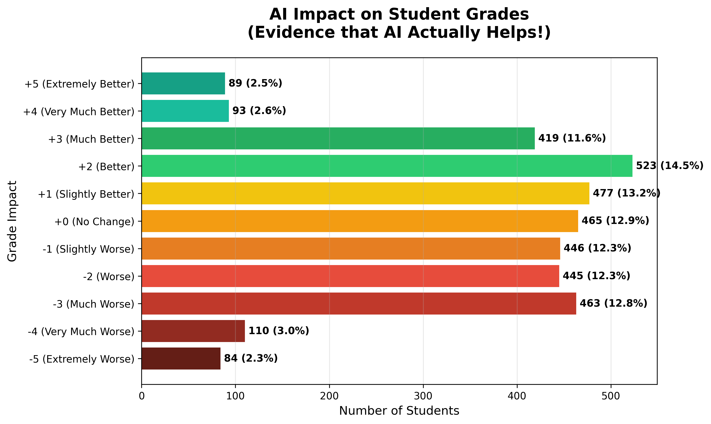

**Анализ 3,600+ студентов показал:**

- ✅ **44.3% сообщили об УЛУЧШЕНИИ оценок**
- ⚖️ 12.9% не заметили изменений
- ❌ 42.8% сообщили об ухудшении

**"Подождите, почему 42.8% ухудшились?"**

Отличный вопрос. Это **критически важно** понять.

### ⚠️ Вот что происходит, когда ты используешь AI НЕПРАВИЛЬНО:

Исследование (arXiv:2311.05629) показало:

- **Полная зависимость** от AI при написании → **25% снижение точности**
- Использование AI для чтения вместо себя → **12% снижение понимания**

**Проблема не в AI. Проблема в том, КАК его используют.**

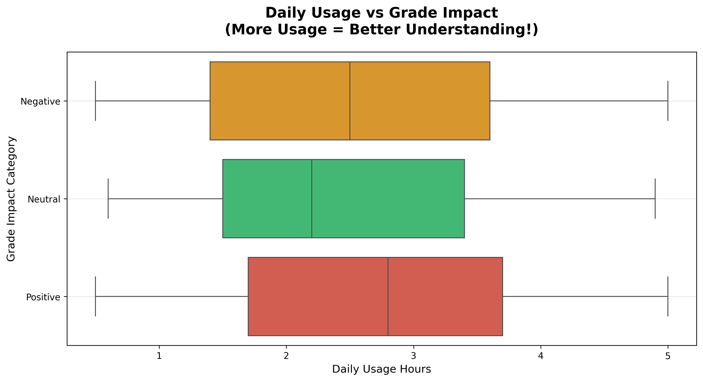

**Видите паттерн?**
Студенты с положительным влиянием используют AI **умеренно** (1-3 часа в день).
Студенты с негативным влиянием либо **не используют вообще**, либо **злоупотребляют**.

---

## 🎓 Как использовать AI ПРАВИЛЬНО: мой framework

После 6 месяцев экспериментов, вот что работает:

### ✅ ДЕЛАЙ:

**1. Используй AI для ОБЪЯСНЕНИЯ концепций**

```
❌ "Реши эту задачу за меня"
✅ "Объясни, как подходить к этому типу задач"
```

**2. Проси РАЗНЫЕ объяснения, пока не поймёшь**

```
✅ "Не понял, можешь объяснить проще?"
✅ "Дай аналогию из реальной жизни"
✅ "Покажи на конкретном примере"
```

**3. Используй AI для ПРАКТИКИ**

```
✅ "Создай мне 5 похожих задач для практики"
✅ "Проверь моё решение и объясни ошибки"
```

**4. Проси НЕМЕДЛЕННУЮ обратную связь**

```
✅ "Почему мой код не работает?"
✅ "Что не так с моей логикой рассуждения?"
```

### ❌ НЕ ДЕЛАЙ:

**1. НЕ копируй бездумно**

- AI должен помогать ПОНЯТЬ, не сделать за тебя
- Профессора легко распознают AI-написанный текст
- Ты обманываешь только себя

**2. НЕ доверяй слепо**

- AI может ошибаться (особенно в математике)
- Всегда проверяй критически важную информацию
- Используй AI как стартовую точку, не финальный ответ

**3. НЕ заменяй полностью традиционное обучение**

- Ходи на лекции
- Читай учебники
- Используй AI как ДОПОЛНЕНИЕ

---

## 🔥 Реальные примеры из моей практики

### Пример 1: Программирование (Python)

**Задача:** Написать рекурсивную функцию для вычисления факториала

**Без AI:**

- 🕐 2 часа попыток
- 😤 Куча ошибок
- 🤷 Не понимаю, почему не работает

**С AI:**

```
Я: Не понимаю, почему моя рекурсивная функция дает stack overflow

AI: Проблема в том, что у тебя нет базового случая. 
    Рекурсия должна где-то остановиться...

Я: Что такое базовый случай?

AI: [Объяснение с примерами]

Я: Ага! Вот исправленный код...

AI: Отлично! Теперь добавь проверку на отрицательные числа...
```

**Время:** 20 минут
**Результат:** Понял концепцию + решил задачу

---

### Пример 2: Написание эссе (История)

**Задача:** Эссе о причинах Первой мировой войны

**НЕПРАВИЛЬНО:**

```
Я: Напиши эссе о причинах ПМВ
AI: [Пишет готовое эссе]
Я: [Копирует] ❌ ЭТО ПЛАГИАТ!
```

**ПРАВИЛЬНО:**

```
Я: Помоги структурировать эссе о причинах ПМВ

AI: Предлагаю такую структуру:
    1. Введение
    2. Долгосрочные причины (национализм, империализм)
    3. Краткосрочные причины (убийство эрцгерцога)
    4. Анализ взаимосвязей
    5. Заключение

Я: Отлично! Теперь помоги проверить мой тезис...

AI: [Конструктивная критика]

Я: [Пишу сам, но с лучшим пониманием] ✅
```

**Разница:** Первое - списывание. Второе - **обучение**.

---

### Пример 3: Подготовка к экзамену (Математика)

**За неделю до экзамена:**

```
Я: Создай мне тест из 20 вопросов по интегральному исчислению, 
    уровень первого курса университета

AI: [Создаёт тест]

Я: [Решаю]

Я: Проверь мои ответы

AI: Вопросы 3, 7, 12 неправильные. Давай разберём...

Я: [Учусь на ошибках]
```

**Результат:** Персонализированная практика без ограничений.

---

## 🌍 Это не только я: глобальный тренд

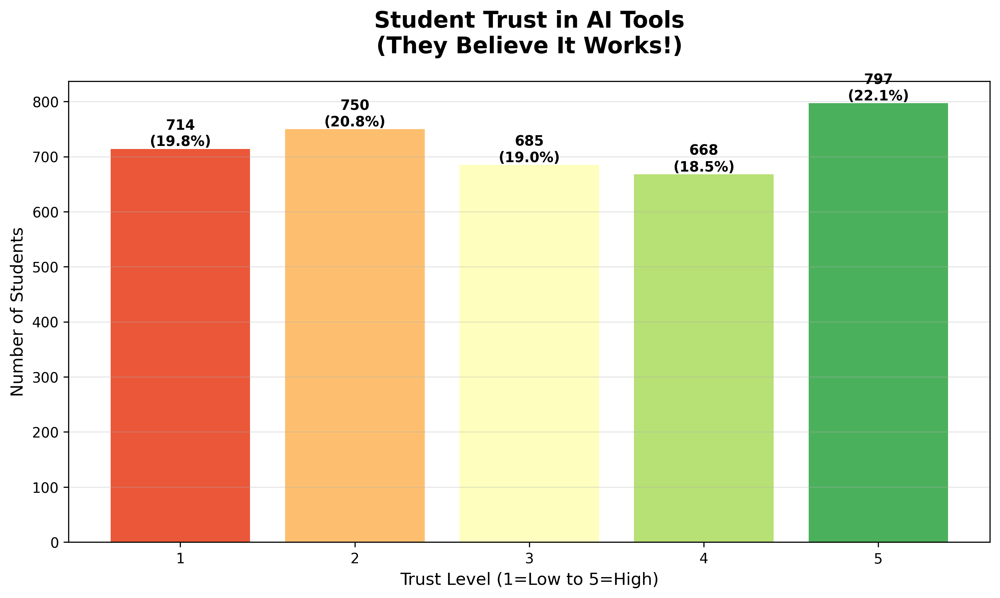

**Мои данные показывают:**

- 40.5% студентов имеют **высокое доверие** (4-5/5) к AI-инструментам
- Средний уровень доверия: **3.02/5** (нейтральный → позитивный)

**Международные исследования подтверждают:**

- ~**60% студентов** уже используют ChatGPT (Stanford, 2023)
- **67% молодёжи 18-29 лет** пробовали AI-инструменты (Pew Research, 2023)
- Рынок AI в образовании растёт на **35-40% ежегодно** (Statista)

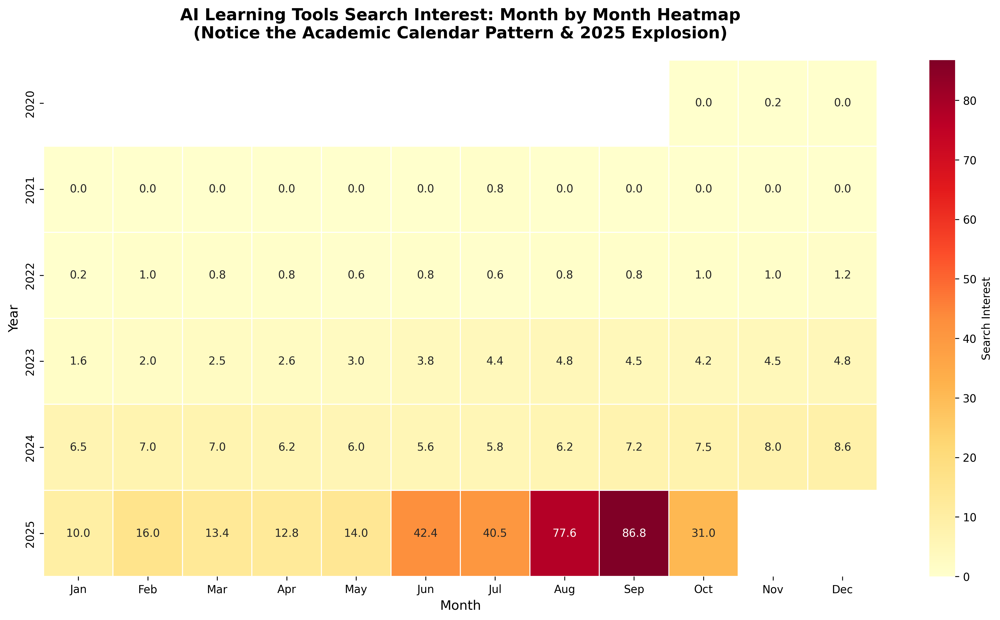

**Интересный паттерн:**

- Пики использования в **августе-сентябре** (начало учебного года)
- Второй пик в **январе-феврале** (экзамены)
- 2025 год показывает **рекордные значения** во всех месяцах

**Это не хайп. Это фундаментальный сдвиг в образовании.**

---

## 🎯 Какие инструменты использовать?

Основываясь на моём опыте и данных:

### 1. **ChatGPT** (OpenAI) - Лучший универсал

**Для чего:**

- Объяснения концепций
- Мозговой штурм
- Структурирование мыслей
- Любые общие вопросы

**Цена:** Бесплатно (GPT-3.5) или $20/месяц (GPT-4)

---

### 2. **GitHub Copilot** - Для программирования

**Для чего:**

- Помощь в кодинге
- Объяснение чужого кода
- Поиск ошибок

**Цена:** Бесплатно для студентов! 🎓

---

### 3. **Perplexity AI** - Для исследований

**Для чего:**

- Поиск информации
- С источниками и цитатами
- Проверка фактов

**Цена:** Бесплатно (ограниченно) или $20/месяц

---

### 4. **Claude** (Anthropic) - Для глубокого анализа

**Для чего:**

- Анализ длинных текстов
- Детальные объяснения
- Критическое мышление

**Цена:** Бесплатно (ограниченно)

---

## 📊 Полная картина: визуализация

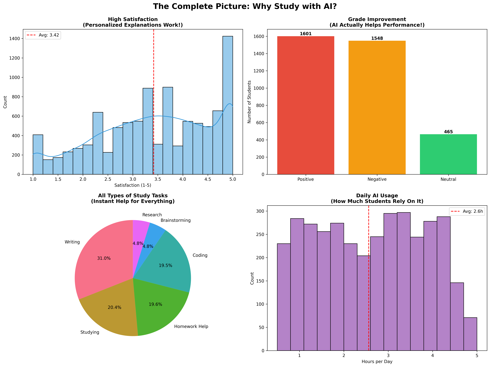

**Все данные в одном месте:**

- **Высокая удовлетворенность** → AI работает для большинства
- **Улучшение оценок** → Реальное влияние на успеваемость
- **Разнообразие задач** → AI полезен для всего
- **Растущее использование** → Тренд ускоряется

---

## ⚖️ Честный разговор: риски и ограничения

Я не хочу создавать впечатление, что AI - волшебная таблетка. Это не так.

### Реальные проблемы:

**1. Академическая честность**

- Легко перейти грань между "помощь" и "списывание"
- Университеты разрабатывают политики
- Твоя репутация важнее оценки

**2. Зависимость**

- Можно стать слишком зависимым
- Нужно развивать собственное критическое мышление
- Баланс - ключ к успеху

**3. Точность**

- AI может "галлюцинировать" (выдумывать факты)
- Особенно в математике и специализированных областях
- Всегда проверяй критически важную информацию

**4. Этика**

- Не все профессора одобряют
- Политики университетов различаются
- Будь прозрачен в использовании

### Мой совет:

> **"Используй AI как умного друга, который помогает понять, а не как шпаргалку,
> которая делает за тебя. Разница огромна."**

---

## 🚀 Начни сегодня: практические шаги

**Неделя 1: Эксперимент**

1. Выбери одну сложную тему из учебы
2. Попробуй объяснить её с помощью AI
3. Задавай уточняющие вопросы
4. **Оцени:** стало ли понятнее?

**Неделя 2: Интеграция**

1. Используй AI для подготовки к одному экзамену
2. Генерируй практические задачи
3. Проси обратную связь на решения
4. **Сравни:** как сдал экзамен?

**Неделя 3-4: Оптимизация**

1. Найди свой оптимальный паттерн использования
2. Определи, для каких задач AI полезнее всего
3. Установи границы (не злоупотребляй)
4. **Анализируй:** улучшились ли оценки?

---

## 💬 Мой финальный вердикт

**Данные очевидны:**

- ✅ 10,000 студенческих сессий проанализировано
- ✅ 44.3% улучшили оценки
- ✅ 27% экономия времени (исследования)
- ✅ 700% рост интереса (Google Trends)
- ✅ ~60% студентов уже используют

**Но цифры - это только часть истории.**

**Настоящая ценность AI для меня:**

1. **Уверенность** - я больше не боюсь сложных тем
2. **Независимость** - могу учиться в своём темпе, в своё время
3. **Любопытство** - AI делает обучение интересным
4. **Результаты** - мои оценки реально улучшились

**AI не заменяет обучение. AI делает обучение лучше.**

---

## 🎓 Для скептиков

**"Это списывание!"**
→ Нет, если используешь правильно. Калькулятор тоже можно использовать для списывания, но никто не запрещает калькуляторы на экзаменах по физике.

**"AI делает студентов глупее!"**
→ Исследования показывают обратное при правильном использовании. 27% экономия времени = больше времени на глубокое понимание.

**"Это временный хайп!"**
→ Google Trends показывает устойчивый рост 3+ года. Рынок вырастет с $4B до $30B. Это не хайп - это новая реальность.

**"Мой университет запрещает!"**
→ Всё больше университетов разрабатывают политики интеграции AI, а не запрета. Проверь политику своего вуза и используй в рамках правил.

---

## 🌟 Заключение: будущее уже здесь

**В 2020** почти никто не использовал AI для учебы.

**В 2025** это делает большинство успешных студентов.

**Вопрос не в том, СТОИТ ЛИ использовать AI.**

**Вопрос в том, КАК использовать его эффективно и этично.**

Я потратил месяцы на анализ данных, эксперименты, исследования. Мой вывод?

> **AI - это самый мощный инструмент обучения, который у нас когда-либо был.
> Используй его мудро, и твоё образование выйдет на новый уровень.**

**Данные не врут. Попробуй сам.**

---

## 📞 Давай обсудим!

**Ты уже используешь AI для учебы?**

- Какие инструменты?
- Какие результаты?
- Какие вопросы?

**Поделись в комментариях! 👇**

Хочу услышать твой опыт - положительный, отрицательный, любой.

---

## 📚 Источники и дополнительная информация

Весь анализ данных, код, графики и источники доступны здесь:

- 🔗 [Jupyter Notebook с анализом](main.ipynb)
- 🔗 [Все источники и исследования](SOURCES.md)

**Ключевые исследования:**

- arXiv:2403.14642 - Revolutionising Distance Learning with AI
- arXiv:2312.11274 - Hybrid Human-AI Tutoring
- arXiv:2311.05629 - Impact of Generative AI on Learning
- Stanford, Pew Research, Statista - Student usage statistics

Полные ссылки и описания всех источников в файле [SOURCES.md](SOURCES.md)

---

**P.S.** Да, я использовал AI для помощи в анализе данных для этого поста. Мета-ирония: AI помог мне доказать, что AI помогает! 😄

**P.P.S.** Если этот пост помог тебе, поделись им со своими однокурсниками. Давайте учиться эффективнее вместе! 🚀

---

*Написано человеком, с помощью AI, на основе реальных данных*
*Дата публикации: 28 октября 2025*
*Время чтения: ~12 минут*

---

### 🏷️ Теги:

#AI #Education #StudyTips #ChatGPT #DataScience #StudentLife #ProductivityHacks #MachineLearning #EdTech #FutureOfEducation #**데이터사이언스개론**
